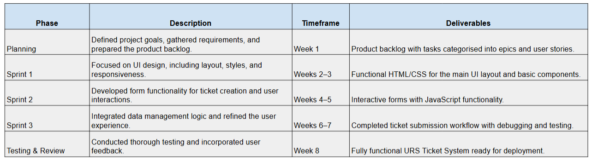
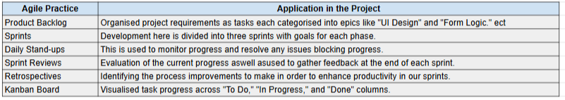

# URS-Ticket-System Code Design

The initial prototype design can be found on this [Link](https://benarnott.github.io/URS-Ticket-System/)

## The Systems Purpose

PURPOSE

My proposed Product is for a User Requirement Specification (URS) ticketing website, this system will allow for my team to gain the core requirements of projects and every day Lab User needs in a formatted way. This HTML based website will act as a centralised place for ticket creation, allowing users to submit the exact fields of information required to complete tasks, creating a more organised environment. A ticketing system is shown to help scalability, ordering tickets based on priority, as well as recording success metrics. The benefits of a ticketing system is shown by a Salesforce measurement, showing a 63% increase in productivity in 2020 after the introduction of a ticketing system (Salesforce, 2022).
The website will feature a simple, user-friendly form that will include the basic fields for essential information such as the Lab Users name, User PRID (employee number), contact details, a description of the request, and the required completion date. Once a ticket has been created the system will notice the Robotics and Automation team in the form of an automated email, allowing for a timely response.

The website will be created using HTML, CSS, and JavaScript, with a focus on creating a responsive design that works on both desktop and mobile devices. JavaScript will handle form validation and interactions, while email functionality will be integrated using a library such as Email.js or SMTP.js to send structured submissions directly to the team. In its initial phase, the website will focus on email notifications, but it could be expanded in the future to include database storage for tracking and analysing past submissions.

One of the many advantages of this platform is that it streamlines communication because all requests are made in one location, removing the need for follow-up emails or meetings. By guaranteeing that new requests are sent to the team in a timely formatted way, it will help increase efficiency. Additionally, the system's scalability allows for the gradual addition of new features to improve functionality, like request tracking and metric analytics. The user interface will be designed, a prototype with email notification and ticket submission features will be made, the system will be tested for dependability, and user feedback will be incorporated to improve the platform. This website will offer a useful and expandable way to assist the workflow of the Robotics and Automation Team through managing user requirements.

## Project Planning

The Agile technique, which prioritises iterative development and collaboration, is used to plan and carry out this project. The project starts by outlining its overall objective, which is to provide a user-friendly ticket submission system for the User Requirement Specifications (URS). The product backlog, which will be organised into epics like "UI Design," "Form Functionality," and "Data Storage," contain the requirements and are divided into smaller, more manageable tasks. The project will be broken up into three two-week-long sprints, each with their own set of deliverables. Daily standups will be used to track progress and resolve any obstacles, and regular sprint planning sessions can be utilised to prioritise work. A review will be conducted at the conclusion of each sprint to review the results and take comments into consideration. 

In order to improve the process for the sprints, retrospectives will also be carried out. To maintain team transparency and visualise the workflow, we can make use of a Kanban board for this. Throughout the development cycle, testing and debugging are given top priority in order to preserve the quality of the final products. This strategy makes sure that the project will be completed in a flexible and progressive manner while successfully fulfilling the requirements.

## User Feedback
[Feedback Form](https://docs.google.com/forms/d/e/1FAIpQLScb-IveZ_1XHtToDfNOmGVE4wiZP1UCcFefLmZl2Nn3_CLj_g/viewform?usp=header) Please fill in the feedback form after reviewing the URS website.

## Design Screenshots

Page 1 - The home page for the application allowing users to create tickets.

Page 2 - The ticket manager, allowing users to edit, delete or share their tickets.

## Creating the Prototype Process

- Designing the Prototype in Figma:
I started by making use of Figma to create the URS ticketing system's user interface, focussing on a simple and user friendly prototype. The design includes items like the general layout, navigation buttons, and the ticket submission form. To guarantee responsiveness and consistency, I selected particular fonts, colours, and element locations.

- Generating CSS Code:
I then converted the design elements into CSS code using a built-in Figma plugin after the design was complete. The style settings, including sizes, colours, and placements, for every component in the design were automatically produced by this plugin from the source design. The exported CSS code was used as the base for the front-end development of the website.

- Uploading the CSS Code:
An index.css file was then created, including the created CSS source code. With all the styles required to duplicate the Figma look, this file acts as the website's stylesheet. I arranged and went over the code to make sure it was accurate and clear. 

- Linking the CSS to HTML:
I used HTML to organise the material in the index.html file and added a <link> element in the <head> section to link it to the index.css file. I then made sure that the visual styles defined in the CSS file were applied to the content by assigning the appropriate CSS classes to every HTML element.

For example:

The navigation buttons ("Create a Ticket" and "View Tickets") were styled using the .rectangle3 and .rectangle4 classes.
Form fields, such as "Full Name" and "User PRID," were styled using classes such as .rectangle6 and .rectangle7 to form mock input boxes.

- Publishing the Prototype:
I published the project using the terminal to make the prototype publicly available. This required the use of  GitHub Websites, allowing me to link the VS Code to the repositry via a hyperlink. I was able to then review and test the functional prototype in a web browser thanks to the procedure' creation of a shared web link. Through this I discovered multiple placement issues with the text while testing. Utilising the inspect element I was able to alter the sizing and layer placement of the text, fixing the issues through VS Code.

## Technical Guide for URS Ticketing System

Technology Stack
The URS Ticketing System is built with the following structure:
- **Frontend**: HTML, CSS, JavaScript
- **Backend (can allow future expansion)**: Node.js (testing/future email usage)

Folder Structure
- `index.html`: Contains the structure of the webpage.
- `index.css`: Provides styling for the webpage.
- `index.js`: Handles form submissions and input validation.

Setting Up the Project Locally
Clone the repository: https://github.com/BenArnott/URS-Ticket-System.git
Install the dependencies: npm install
Run the project using: npm start

Testing Code Explanation
- The form submission event is handled in `index.js`, where data from the input fields is retrieved and displayed in the `output-field`.

## Evaluation
The creation of the URS Ticketing System has given important insights into the benefits and issues of creating a user-friendly ticket management system. Although there were a few challenges to overcome and numerous chances for future improvements/scalability, the system effectively creates a prototype design for users to submit requests via a form.

Challenges I discovered

Placing the input boxes inside the allotted space (rectangle6) was one of my main issues faced during the development process. At first, there was overlap with the surrounding text due to the form elements' misalignment. This was fixed by trial and error within Inspect Elements, allowing me to modify the top, and left properties in the CSS to guarantee correct positioning. Although this problem was eventually fixed, it took longer than expected and demonstrated the importance of thorough layout planning and testing when working with forms in web design. 

Current Features

At the moment, the system demonstrates a straightforward, practical form design for users to enter personal information with a showcase of how they would input string information like their name. Simplifying communication with the Robotics and Automation Team requires this fundamental feature as the company scales up, increasing project demands.
The system can be improved in a number of areas to allow for a better user experience which will be discussed below.

Potential Upgrades and Scalability

- More Input Fields: The form could be improved by including more specialised input fields as the system is scaled up to meet more complicated user requests. A dropdown menu to classify requests using labels (such as "Technical Support," "Software Issue," or "Equipment Request"), for instance, could aid the organisation in setting priorities. This would be enhanced through the user feedback google form distributed in the README section.

- Improved Email Notification System: The team receives a single email upon submissions from the current email notification system. This could be extended in a number of ways, such as giving users email confirmations once their request has been fulfilled or incorporating automated follow-up reminders when deadlines get close. In order to increase workflow efficiency, the system may also notify various teams based on the type of request, this would be streamlined by the label suggestion above.

- Integration with Dashboards: For real-time analytics, the system may be integrated with external metric dashboards as it gathers more data. This would make it possible to measure important metrics like priority status, completion times, and ticket submission rates. Using programs like Tableau to visualise this data would improve work management and offer useful insights about team performance. This is especially important for small teams as having metrics to show performance and demand could aid in gaining further investment or headcount from management.

- Database Integration: Although the system is currently designed to only use email alerts, adding a database would improve request tracking and storing. More advanced reporting of historical data through data storage, and search capabilities might be made possible with a back-end database such as MongoDB or MySQL. Over time, this would facilitate ticket management and guarantee that no request is forgotten or lost.

- User Authentication: To guarantee that authorised employees are able to submit requests, the system could include user authentication in future versions. This would be essential considering the nature of the work done within the labs, as more projects come in the chances of the requirements being confidential will increase.

## Conclusion

Overall the URS Ticketing System prototype provides foundation for simplifying the gathering and administration of user requirements. The system design has been successfully deployed, providing the Robotics and Automation Team with a simple yet useful solution example. Going forward, there is a lot of room for changes in the system, including more input fields, improved email alerts, and integration with databases. Through the application of data analytics, these modifications would not only improve the system's functionality but also offer greater insight into our companies workflow. With these future changes, the system can grow to meet future demands and offer a complete platform for effectively handling project requests.

